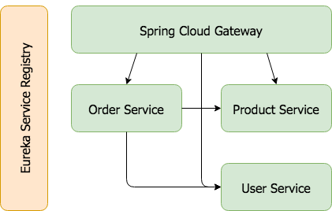

# Spring Cloud Sample App

## Overview
Meant to demonstrate how to use Spring Cloud components.  Currently utilizes

* [Spring Cloud Gateway 2](https://cloud.spring.io/spring-cloud-gateway/)
* [Eureka](https://cloud.spring.io/spring-cloud-netflix/)
* [Hystrix](https://cloud.spring.io/spring-cloud-netflix/)
* [Actuator](https://spring.io/guides/gs/actuator-service/)
* [Sleuth](https://cloud.spring.io/spring-cloud-sleuth/)

## System Interaction Diagram



## Running the Sample
### Install Spring Cloud Command Line And Run Eureka Server and Hystrix Dashboard Locally
See the [Spring Cloud CLI](http://cloud.spring.io/spring-cloud-cli/) for more specific details.

On MacOS if you have  [Homebrew](https://brew.sh/) installed:
```bash
$ brew install spring
$ spring install org.springframework.cloud:spring-cloud-cli:1.4.0.RELEASE
$ spring cloud eureka hystrixdashboard
```

Open the [Eureka Server](http://localhost:8761) and [Hystrix Dashboard](http://localhost:7979/) 
in your web browser.

## Checkout And Build Sample 
```bash
$ git clone https://github.com/bthelen/spring-cloud-sample
$ cd spring-cloud-sample
$ ./mvnw clean install
```

## Run Sample In Your Preferred Way
* Use `Run Configurations` Provided From within `IntelliJ`
* Use `./mvnw -f ./<insert component here>/pom.xml spring-boot:run` for each component in the sample  

## Test Deployment
### View All Routes Registered With Spring Cloud Gateway
```bash
$ curl http://localhost:8080/actuator/gateway/routes 
```
### Call User Service Directly To Enumerate All users
```bash
$ curl http://localhost:8080/user-service/users 
```
### Call User Service Directly To View A Specific user
```bash
$ curl http://localhost:8080/user-service/users/1
```
### Call Order Service To View All Orders Which Cascades Calls To Product And User Service
```bash
$ curl http://localhost:8080/order-service/orders 
```